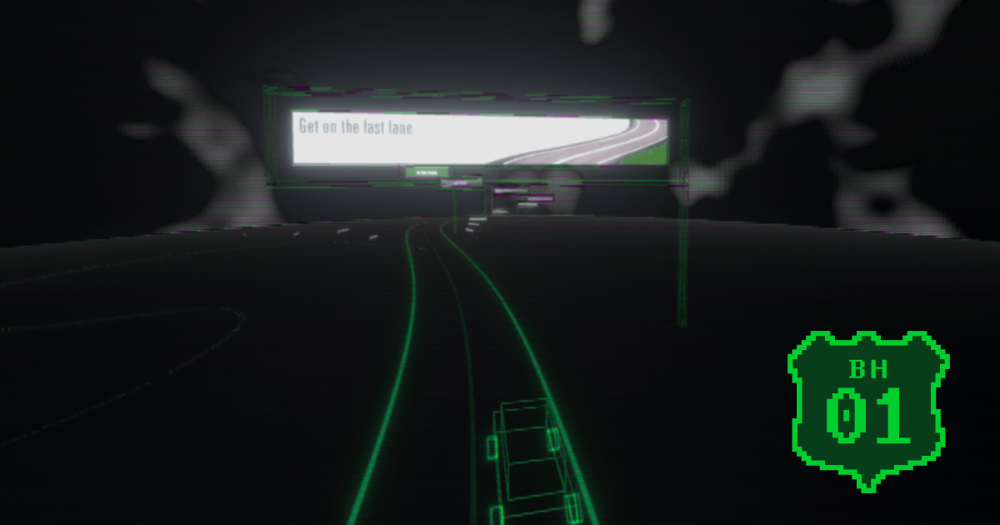

# Banner Highway 01

This is the repository for Banner Highway 01: Get on the Fast Lane, 汽车是旅行的工具, as featured in the HTML Review, March 2026 issue.

Access the live experience at [https://highway-01.banner-depot-2000.net/](https://highway-01.banner-depot-2000.net/).



Banner Highway is a series of browser-based visual poetry. It is a reimagination of the classic Burma-Shave roadside advertisement-poems for the Information Superhighway. The reader drives down a virtual highway lined with billboards featuring static frames of 1990s-early 2000s web banner ads. As each billboard comes into view, fragments of early web advertising texts appear in sequence, forming messages that resemble mid-century roadside commercial verse. Just as the Burma-Shave signs have become symbols for 1950s Americana, early web banners may now have begun to evoke a similar nostalgia, reminding us of a time when the Internet still felt like a road worth traveling, and every sign along the way promised something just ahead.

## Repository Structure

```text
design-assets/  Figma design assets (favicons, opengraph images, etc.)
media-assets/   Source banners + MIDI originals uploaded through the editor
website/        Main web application (see website/README.md)
```
